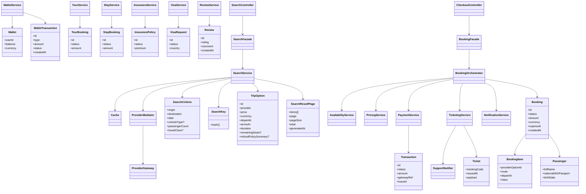
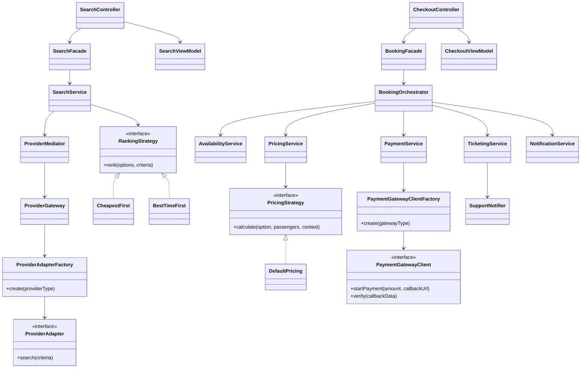
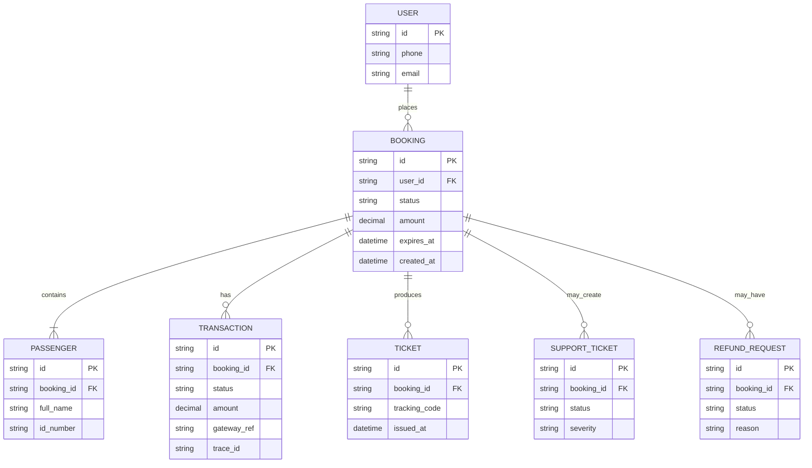
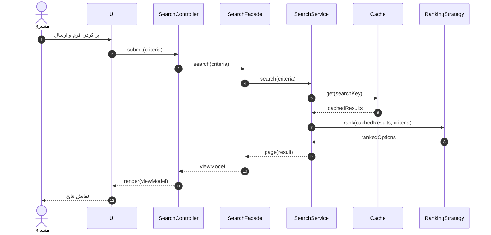
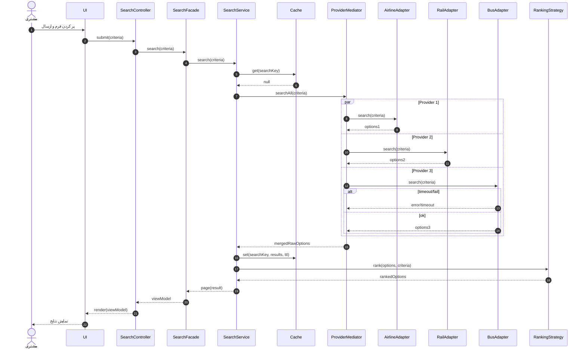
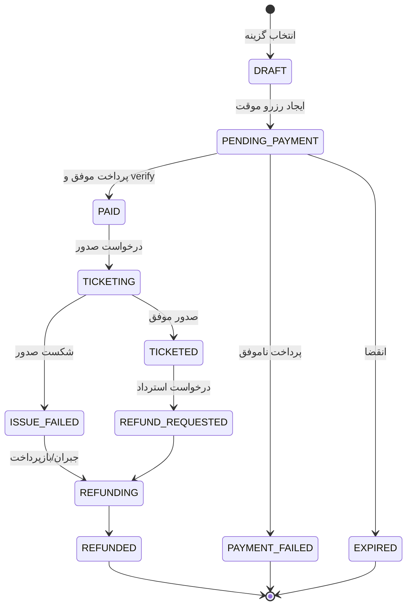
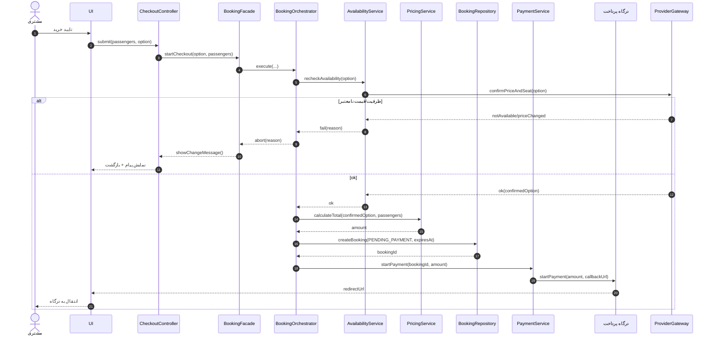
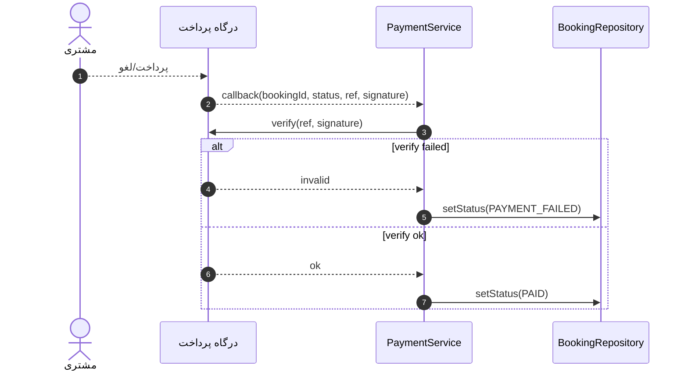
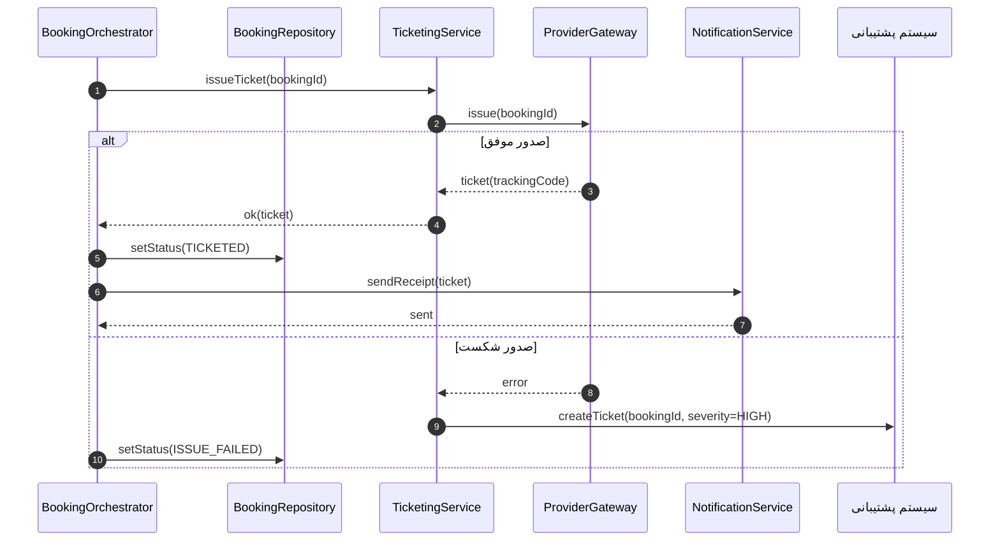
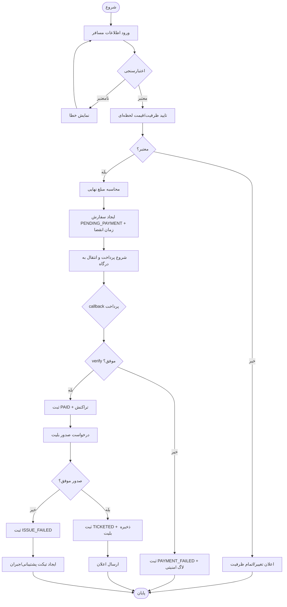

<div dir="rtl">

# فاز ۲ — نمودارها و عینیت‌بخشی با Mermaid (سامانه آژانس مسافرتی «مارکوپولو»)

- سازمان: آژانس مسافرتی «مارکوپولو»
- سامانه: سامانه فروش/رزرو خدمات سفر (وب/موبایل)
- خروجی فاز ۲: Actor/Use Case (سطح سیستم) + عینیت‌بخشی ۲ موردکاربری (سناریو، CRC، کلاس تحلیلی/طراحی، توالی، فعالیت)

> نکته فنی: Mermaid نمودار «Use Case UML» را به‌صورت مستقیم پشتیبانی نمی‌کند؛ در این فایل، مدل موردکاربری را با `flowchart` + برچسب‌های `<<include>>/<<extend>>` نمایش می‌دهیم تا در Markdown رندر شود.

---

## 0) واژه‌نامه و فرض‌ها

- **مشتری (Guest/Authenticated):** کاربر نهایی؛ ممکن است بدون ورود جستجو کند، اما برای خرید/پیگیری سفارش ورود لازم است.
- **تأمین‌کننده (Supplier):** شرکت هواپیمایی/ریلی/اتوبوسرانی یا سرویس تجمیع‌کننده که API ارائه می‌دهد.
- **سامانه درگاه پرداخت:** سرویس بانکی برای شروع پرداخت و callback/verify.
- **سیستم پشتیبانی:** سیستم تیکت/CRM برای مدیریت رخدادها و خطاهای عملیاتی.

---

## 1) مدل موارد کاربری (سطح سیستم) — جامع

### 1-1) بازیگران (Actors)

- مشتری (مهمان)
- مشتری (عضو/ورود کرده)
- تأمین‌کننده خدمات سفر (سیستم/کاربر سازمانی)
- سامانه درگاه پرداخت بانکی
- اپراتور پشتیبانی
- مدیر سامانه (ادمین)

### 1-2) نمودار موارد کاربری (با include/extend)

```mermaid
flowchart RL
  Guest([مشتری (مهمان)])
  User([مشتری (عضو)])
  Supplier([تأمین‌کننده])
  Bank([درگاه پرداخت])
  SupportAgent([اپراتور پشتیبانی])
  Admin([مدیر سامانه])

  subgraph System[سامانه مارکوپولو]
    subgraph Account[حساب کاربری]
      UC_Register([ثبت‌نام])
      UC_Login([ورود/خروج])
      UC_Profile([مدیریت پروفایل])
    end

    subgraph Ticketing[بلیت (پرواز داخلی/خارجی، قطار، اتوبوس)]
      UC_Search([جست‌وجوی خدمات سفر])
      UC_AdvSearch([جستجوی پیشرفته (بهترین/ارزان‌ترین/سریع‌ترین)])
      UC_ViewDetails([مشاهده جزئیات گزینه])
      UC_FilterSort([فیلتر/مرتب‌سازی/صفحه‌بندی])
      UC_Select([انتخاب گزینه سفر])
      UC_BuyTicket([خرید بلیت])
      UC_Checkout([ثبت اطلاعات مسافران و تایید خرید])
      UC_Availability([تأیید ظرفیت/قیمت])
      UC_Pricing([محاسبه قیمت نهایی/کارمزد/تخفیف])
      UC_IssueTicket([صدور بلیت])
      UC_Refund([استرداد بلیت])
      UC_ViewOrders([مشاهده سوابق سفارش‌ها])
    end

    subgraph Tourism[گردشگری و خدمات جانبی]
      UC_ViewTours([مشاهده تورها (داخلی/خارجی)])
      UC_ReserveTour([رزرو تور])
      UC_SearchStay([جستجوی اقامتگاه/هتل])
      UC_ReserveStay([رزرو اقامتگاه/هتل])
      UC_Insurance([خرید/صدور بیمه مسافرتی])
      UC_Visa([درخواست/پیگیری ویزا])
    end

    subgraph Payments[پرداخت و کیف پول]
      UC_Payment([پردازش پرداخت‌های مالی])
      UC_PayGateway([پرداخت از طریق درگاه بانکی])
      UC_Wallet([مدیریت کیف پول آنلاین (موجودی/تراکنش)])
      UC_TopUp([افزایش موجودی کیف پول])
      UC_PayWallet([پرداخت با کیف پول])
      UC_RefundWallet([بازگشت وجه به کیف پول/کارت])
    end

    subgraph SupportAndFeedback[پشتیبانی و بازخورد]
      UC_OpenTicket([ثبت درخواست پشتیبانی])
      UC_TrackTicket([پیگیری درخواست پشتیبانی])
      UC_Review([ثبت نظر و امتیازدهی])
    end

    subgraph SupplierOps[تعامل با تأمین‌کنندگان]
      UC_SupplierCatalog([به‌روزرسانی کاتالوگ/قیمت/قوانین])
      UC_Settle([تسویه‌حساب با تأمین‌کنندگان])
    end

    subgraph AdminOps[مدیریت سامانه]
      UC_AdminUsers([مدیریت کاربران/سطوح دسترسی])
      UC_AdminConfig([مدیریت تنظیمات/قوانین/کارمزدها])
      UC_AdminReports([گزارش‌ها/مانیتورینگ])
    end

    UC_Notify([ارسال اعلان/ایمیل/پیامک])
  end

  Guest --> UC_Search
  Guest --> UC_AdvSearch
  Guest --> UC_ViewDetails
  Guest --> UC_FilterSort
  Guest --> UC_ViewTours
  Guest --> UC_SearchStay
  Guest --> UC_Register
  Guest --> UC_Login

  User --> UC_Search
  User --> UC_AdvSearch
  User --> UC_ViewDetails
  User --> UC_FilterSort
  User --> UC_Select
  User --> UC_BuyTicket
  User --> UC_Checkout
  User --> UC_ViewOrders
  User --> UC_Refund
  User --> UC_ReserveTour
  User --> UC_ReserveStay
  User --> UC_Insurance
  User --> UC_Visa
  User --> UC_Wallet
  User --> UC_Review
  User --> UC_OpenTicket
  User --> UC_TrackTicket
  User --> UC_Profile

  Supplier --> UC_SupplierCatalog
  Supplier --> UC_Settle

  Bank --> UC_PayGateway
  SupportAgent --> UC_TrackTicket

  Admin --> UC_AdminUsers
  Admin --> UC_AdminConfig
  Admin --> UC_AdminReports

  UC_ViewDetails -. "<<include>>" .-> UC_Search
  UC_FilterSort -. "<<extend>>" .-> UC_Search
  UC_AdvSearch -. "<<extend>>" .-> UC_Search
  UC_Select -. "<<include>>" .-> UC_ViewDetails
  UC_BuyTicket -. "<<include>>" .-> UC_Checkout
  UC_Checkout -. "<<include>>" .-> UC_Availability
  UC_Checkout -. "<<include>>" .-> UC_Pricing
  UC_Checkout -. "<<include>>" .-> UC_Payment
  UC_Checkout -. "<<include>>" .-> UC_IssueTicket
  UC_IssueTicket -. "<<include>>" .-> UC_Notify

  UC_ReserveTour -. "<<include>>" .-> UC_Payment
  UC_ReserveTour -. "<<include>>" .-> UC_Notify
  UC_ReserveStay -. "<<include>>" .-> UC_Payment
  UC_ReserveStay -. "<<include>>" .-> UC_Notify
  UC_Insurance -. "<<include>>" .-> UC_Payment
  UC_Insurance -. "<<include>>" .-> UC_Notify
  UC_Visa -. "<<include>>" .-> UC_Payment
  UC_Visa -. "<<include>>" .-> UC_Notify

  UC_PayGateway -. "<<extend>>" .-> UC_Payment
  UC_PayWallet -. "<<extend>>" .-> UC_Payment
  UC_TopUp -. "<<include>>" .-> UC_Wallet
  UC_RefundWallet -. "<<include>>" .-> UC_Payment

  UC_Refund -. "<<include>>" .-> UC_Payment
  UC_Refund -. "<<include>>" .-> UC_Notify
  UC_Review -. "<<extend>>" .-> UC_ViewOrders
```

### 1-3) جدول روابط include/extend (برای مستندسازی)

| موردکاربری | نوع رابطه | با |
| --- | --- | --- |
| مشاهده جزئیات گزینه | include | جست‌وجوی خدمات سفر |
| فیلتر/مرتب‌سازی/صفحه‌بندی | extend | جست‌وجوی خدمات سفر |
| جستجوی پیشرفته | extend | جست‌وجوی خدمات سفر |
| ثبت اطلاعات مسافران و تایید خرید | include | تأیید ظرفیت/قیمت |
| ثبت اطلاعات مسافران و تایید خرید | include | محاسبه قیمت نهایی |
| ثبت اطلاعات مسافران و تایید خرید | include | پردازش پرداخت‌های مالی |
| ثبت اطلاعات مسافران و تایید خرید | include | صدور بلیت |
| صدور بلیت | include | ارسال اعلان/ایمیل/پیامک |
| رزرو تور | include | پردازش پرداخت‌های مالی |
| رزرو تور | include | ارسال اعلان/ایمیل/پیامک |
| رزرو اقامتگاه/هتل | include | پردازش پرداخت‌های مالی |
| رزرو اقامتگاه/هتل | include | ارسال اعلان/ایمیل/پیامک |
| خرید/صدور بیمه مسافرتی | include | پردازش پرداخت‌های مالی |
| خرید/صدور بیمه مسافرتی | include | ارسال اعلان/ایمیل/پیامک |
| درخواست/پیگیری ویزا | include | پردازش پرداخت‌های مالی |
| درخواست/پیگیری ویزا | include | ارسال اعلان/ایمیل/پیامک |
| پرداخت از طریق درگاه بانکی | extend | پردازش پرداخت‌های مالی |
| پرداخت با کیف پول | extend | پردازش پرداخت‌های مالی |
| افزایش موجودی کیف پول | include | مدیریت کیف پول آنلاین |
| استرداد بلیت | include | پردازش پرداخت‌های مالی |
| استرداد بلیت | include | ارسال اعلان/ایمیل/پیامک |
| ثبت نظر و امتیازدهی | extend | مشاهده سوابق سفارش‌ها |

### 1-4) جدول پوشش موارد کاربری (از «سندهای شما» و «لیست استاد»)

| منبع | عبارت/فعالیت در متن | موردکاربری در این سند |
| --- | --- | --- |
| استاد (سازمان آژانس) | خرید بلیت شبانه‌روزی | `خرید بلیت` + `پرداخت‌های مالی` |
| استاد (سازمان آژانس) | استرداد بلیت | `استرداد بلیت` + `پرداخت‌های مالی` |
| استاد (سازمان آژانس) | جستجوی پیشرفته برای یافتن مناسب‌ترین بلیت | `جستجوی پیشرفته` (extend روی `جست‌وجوی خدمات سفر`) |
| استاد (سازمان آژانس) | مشاهده و رزرو تورهای داخلی و خارجی | `مشاهده تورها` + `رزرو تور` |
| استاد (سازمان آژانس) | ثبت نظر و امتیازدهی به ارائه خدمات | `ثبت نظر و امتیازدهی` |
| استاد (سازمان آژانس) | خدمات پشتیبانی ۲۴ ساعته و ثبت درخواست | `ثبت درخواست پشتیبانی` + `پیگیری درخواست پشتیبانی` |
| استاد (سازمان آژانس) | خدمات بیمه مسافرتی | `خرید/صدور بیمه مسافرتی` |
| استاد (سازمان آژانس) | جستجو و رزرو اقامتگاه | `جستجوی اقامتگاه/هتل` + `رزرو اقامتگاه/هتل` |
| استاد (سازمان آژانس) | پرداخت از طریق درگاه امن و کیف پول آنلاین | `پرداخت از طریق درگاه بانکی` + `مدیریت کیف پول` + `پرداخت با کیف پول` |
| استاد (سازمان آژانس) | رزرو هتل | `رزرو اقامتگاه/هتل` |
| استاد (سازمان آژانس) | ویزا | `درخواست/پیگیری ویزا` |
| سند شما (`BusinessModeling.md`) | جستجوی خدمات سفر | `جست‌وجوی خدمات سفر` |
| سند شما (`BusinessModeling.md`) | خرید بلیت سفر | `خرید بلیت` |
| سند شما (`BusinessModeling.md`) | استرداد بلیت | `استرداد بلیت` |
| سند شما (`BusinessModeling.md`) | مشاهده و رزرو خدمات گردشگری (تور/اقامتگاه) | `مشاهده تورها` + `رزرو تور` + `جستجوی اقامتگاه/هتل` + `رزرو اقامتگاه/هتل` |
| سند شما (`BusinessModeling.md`) | دریافت خدمات پشتیبانی | `ثبت/پیگیری درخواست پشتیبانی` |
| سند شما (`BusinessModeling.md`) | ارائه خدمات سفر توسط تأمین‌کننده | `به‌روزرسانی کاتالوگ/قیمت/قوانین` |
| سند شما (`BusinessModeling.md`) | تسویه حساب مالی با تأمین‌کنندگان | `تسویه‌حساب با تأمین‌کنندگان` |
| سند شما (`Vision.md`) | عضویت و ورود + سوابق خرید | `ثبت‌نام` + `ورود/خروج` + `مشاهده سوابق سفارش‌ها` |

---

## 2) مدل مشترک (یکتا) — CRC + Class Diagram + Model داده

این بخش «یکتا» است و برای همهٔ موردکاربری‌ها استفاده می‌شود. در هر UC فقط نمودارهایی را می‌کشیم که واقعاً وابسته به همان فعالیت/سناریو هستند (مثل Sequence/Activity/State).

### 2-1) CRC (تحلیل) — مشترک

| کلاس | مسئولیت‌ها | همکاران |
| --- | --- | --- |
| `SearchController` | دریافت ورودی جستجو، اعتبارسنجی اولیه، ساخت ViewModel | `SearchFacade`, `SearchViewModel` |
| `CheckoutController` | دریافت داده‌های پرداخت/مسافر، مدیریت UX خرید | `BookingFacade`, `CheckoutViewModel` |
| `TourController` | نمایش/رزرو تور، مدیریت جزئیات | `TourService`, `PaymentService`, `NotificationService` |
| `StayController` | جستجو/رزرو اقامتگاه/هتل | `StayService`, `PaymentService`, `NotificationService` |
| `InsuranceController` | صدور بیمه مسافرتی و پیگیری | `InsuranceService`, `PaymentService`, `NotificationService` |
| `VisaController` | ثبت/پیگیری درخواست ویزا | `VisaService`, `PaymentService`, `NotificationService`, `SupportNotifier` |
| `WalletController` | نمایش موجودی، افزایش موجودی، مدیریت تراکنش‌ها | `WalletService`, `PaymentService` |
| `ReviewController` | ثبت/ویرایش/حذف نظر و امتیاز | `ReviewService` |
| `SearchFacade` | نقطه ورود یکتا برای جستجو، هماهنگی سرویس‌ها | `SearchService`, `SearchPolicy` |
| `BookingFacade` | نقطه ورود یکتا برای خرید، هماهنگی availability/pricing/payment/issue | `BookingOrchestrator` |
| `SearchService` | Cache، فراخوانی Providerها، normalize/merge/dedup، رتبه‌بندی | `Cache`, `ProviderMediator`, `RankingStrategy`, `DedupService` |
| `BookingOrchestrator` | اجرای گام‌های خرید + مدیریت جبران | `AvailabilityService`, `PricingService`, `PaymentService`, `TicketingService`, `SupportNotifier`, `NotificationService`, `BookingRepository` |
| `ProviderMediator` | هماهنگی چند Provider، timeout/retry، جمع‌آوری پاسخ‌ها | `ProviderGateway` |
| `ProviderGateway` | ارتباط با Providerها و تبدیل داده‌ها | `ProviderAdapterFactory`, `ProviderAdapter` |
| `PaymentService` | آغاز پرداخت، verify callback، ثبت تراکنش | `PaymentGatewayClientFactory`, `TransactionRepository` |
| `TicketingService` | صدور بلیت، retry محدود، ذخیره Ticket | `ProviderGateway`, `TicketRepository`, `SupportNotifier` |
| `NotificationService` | ارسال ایمیل/پیامک/نوتیفیکیشن | `TemplateEngine` |
| `SupportNotifier` | ایجاد تیکت برای رخدادهای بحرانی | `SupportSystemClient` |
| `Cache` | ذخیره/بازیابی نتایج جستجو با TTL | `SearchKey` |
| `BookingRepository` | ذخیره سفارش و تغییر وضعیت‌ها | `Booking` |
| `TransactionRepository` | ذخیره تراکنش‌ها و traceId | `Transaction` |
| `TicketRepository` | ذخیره بلیت/واچر | `Ticket` |
| `TourService` | فهرست/جزئیات تور، رزرو تور، قوانین کنسلی | `ProviderGateway`, `TourBookingRepository` |
| `StayService` | جستجو/رزرو اقامتگاه/هتل، ظرفیت، قوانین | `ProviderGateway`, `StayBookingRepository` |
| `InsuranceService` | صدور بیمه، محاسبه حق بیمه، نگهداری بیمه‌نامه | `InsurancePolicyRepository` |
| `VisaService` | ثبت و مدیریت درخواست ویزا، پیگیری وضعیت | `VisaRequestRepository`, `SupportNotifier` |
| `WalletService` | مدیریت موجودی، قفل/آزادسازی وجه، تراکنش‌ها | `WalletRepository`, `WalletTransactionRepository` |
| `ReviewService` | ثبت/نمایش/میانگین امتیاز، ضداسپم | `ReviewRepository`, `UserRepository` |

### 2-2) Class Diagram (تحلیلی) — مشترک



### 2-3) Class Diagram (طراحی) — مشترک + الگوهای طراحی

- **MVC:** `SearchController`, `CheckoutController` → ViewModelها
- **Facade:** `SearchFacade`, `BookingFacade`
- **Strategy:** `RankingStrategy` (جستجو)، `PricingStrategy` (خرید)، `RefundPolicyStrategy` (در صورت افزودن UC-03)
- **Factory Method:** `ProviderAdapterFactory`, `PaymentGatewayClientFactory`
- **Mediator:** `ProviderMediator` (هماهنگی چند Provider)



### 2-4) مدل داده (یکتا) — ER Diagram



---

## 3) عینیت‌بخشی — UC-01 (ساده): «جست‌وجوی خدمات سفر»

### 3-1) مشخصات موردکاربری (Fully Dressed)

- **شناسه:** UC-01
- **نام:** جست‌وجوی خدمات سفر
- **سطح:** کاربری (User Goal)
- **کنشگر اصلی:** مشتری (مهمان/عضو)
- **کنشگرهای ثانویه:** تأمین‌کنندگان (API)
- **ذی‌نفعان:**
  - مشتری: سریع‌ترین و دقیق‌ترین نتایج با شفافیت قیمت و قوانین
  - سازمان: تبدیل جستجو به خرید، کاهش خطا و افزایش رضایت
  - تأمین‌کننده: نمایش صحیح ظرفیت/قیمت و کاهش درخواست‌های تکراری
- **پیش‌شرط‌ها:** اتصال شبکه برقرار؛ تأمین‌کنندگان حداقل یکی در دسترس
- **پس‌شرط موفق:** فهرست گزینه‌ها به‌صورت صفحه‌بندی‌شده به کاربر نمایش داده می‌شود (یا «عدم موجودی»)
- **محرک (Trigger):** کاربر فرم جستجو را ارسال می‌کند

### 3-2) جریان اصلی (Main Success Scenario)

1) کاربر معیارها را وارد می‌کند: مبدأ، مقصد، تاریخ، نوع وسیله (اختیاری)، تعداد مسافر، کلاس (اختیاری).
2) سامانه اعتبارسنجی می‌کند (فرمت تاریخ، عدم برابری مبدأ/مقصد، تاریخ در گذشته نباشد، تعداد مسافر معتبر).
3) سامانه یک کلید جستجو (SearchKey) می‌سازد و Cache را بررسی می‌کند.
4) اگر Cache hit بود، نتایج را بازیابی می‌کند؛ در غیر این‌صورت:
5) سامانه برای هر Provider فعال، درخواست جستجو ارسال می‌کند (با timeout و retry محدود).
6) پاسخ‌ها به مدل داخلی تبدیل می‌شوند (Normalization: واحد پول/زمان/کلاس/قوانین).
7) سامانه نتایج را merge می‌کند و duplicateها را حذف/ادغام می‌کند.
8) سامانه رتبه‌بندی/مرتب‌سازی پیش‌فرض را اعمال می‌کند (مثلاً کمترین قیمت سپس زمان حرکت).
9) سامانه صفحه‌بندی و خلاصه فیلترها را تولید می‌کند.
10) سامانه نتایج را نمایش می‌دهد.

### 3-3) توسعه‌ها (Extensions / Alternate Flows)

- **E1 — ورودی نامعتبر (در گام 2):** پیام خطا + هایلایت فیلدها، بازگشت به فرم
- **E2 — Cache miss + Provider timeout (در گام 5):** حذف Provider از نتایج همان درخواست، ثبت لاگ، نمایش هشدار «برخی منابع در دسترس نیستند»
- **E3 — هیچ نتیجه‌ای یافت نشد (در گام 10):** نمایش «عدم موجودی» + پیشنهاد تاریخ‌های نزدیک
- **E4 — محدودیت نرخ درخواست (Rate Limit):** نمایش پیام «لطفاً چند لحظه بعد تلاش کنید»

### 3-4) قوانین کسب‌وکار و NFRهای مرتبط

- **BR-01:** قیمت نمایش داده‌شده شامل مالیات/کارمزد (یا تفکیک‌شده) باید شفاف باشد.
- **BR-02:** نتایج باید با timestamp «آخرین بروزرسانی» مشخص شوند.
- **NFR-01 (کارایی):** 95% درخواست‌های جستجو < 3s (با Cache/Timeout مناسب).
- **NFR-02 (دسترس‌پذیری):** در صورت down شدن برخی Providers، سیستم باید degrade شود نه crash.

### 3-5) نمودارهای توالی (Sequence) — پیشنهاد تفکیک برای خوانایی

بهتر است نمودارهای توالی را به چند نمودار کوچک‌تر تقسیم کنیم (به‌جای یک نمودار خیلی شلوغ). اینجا UC-01 را به دو سناریوی اصلی جدا کرده‌ایم: **Cache Hit** و **Cache Miss**.

#### 3-5-الف) UC-01 — Cache Hit



#### 3-5-ب) UC-01 — Cache Miss + چند Provider + خطا/Timeout



### 3-6) نمودار فعالیت (Activity) — اعتبارسنجی، Cache، Degrade، صفحه‌بندی

```mermaid
flowchart TD
  A([شروع]) --> B[دریافت معیارها]
  B --> C{اعتبارسنجی}
  C -- نامعتبر --> C1[نمایش خطا و اصلاح] --> B
  C -- معتبر --> D[ساخت SearchKey]
  D --> E{Cache hit؟}
  E -- بله --> F[خواندن نتایج از Cache]
  E -- خیر --> G[فراخوانی Providerها با timeout/retry]
  G --> H[Normalize + Merge + حذف تکراری‌ها]
  H --> I[ذخیره در Cache (TTL)]
  F --> J[اعمال مرتب‌سازی/رتبه‌بندی]
  I --> J
  J --> K[فیلتر/مرتب‌سازی کاربر + صفحه‌بندی]
  K --> L{نتیجه دارد؟}
  L -- خیر --> M[نمایش عدم موجودی + پیشنهاد تاریخ نزدیک] --> Z([پایان])
  L -- بله --> N[نمایش نتایج + زمان بروزرسانی] --> Z([پایان])
```

---

## 4) عینیت‌بخشی — UC-02 (متوسط/پیچیده): «خرید بلیت سفر»

### 4-1) مشخصات موردکاربری (Fully Dressed)

- **شناسه:** UC-02
- **نام:** خرید بلیت سفر
- **سطح:** کاربری (User Goal)
- **کنشگر اصلی:** مشتری (عضو)
- **کنشگرهای ثانویه:** درگاه پرداخت، تأمین‌کننده، سیستم پشتیبانی، سرویس اعلان
- **پیش‌شرط‌ها:**
  - کاربر وارد سامانه شده است.
  - کاربر یک گزینه سفر انتخاب کرده است.
  - قوانین استرداد/هویت مسافر در دسترس است.
- **پس‌شرط موفق:** سفارش در وضعیت `TICKETED` و بلیت/کد رهگیری به کاربر تحویل داده می‌شود.
- **محرک:** کاربر دکمه «تایید و پرداخت» را می‌زند.

### 4-2) جریان اصلی (Main Success Scenario)

1) کاربر اطلاعات مسافران را وارد و تایید می‌کند.
2) سامانه داده‌ها را اعتبارسنجی می‌کند (فرمت/سن/کدملی/پاسپورت، تطابق تعداد مسافر).
3) سامانه با تأمین‌کننده، **ظرفیت و قیمت لحظه‌ای** را دوباره تأیید می‌کند.
4) سامانه قیمت نهایی را محاسبه می‌کند (کارمزد، تخفیف، مالیات).
5) سامانه یک سفارش/رزرو موقت (`PENDING_PAYMENT`) ایجاد می‌کند و زمان انقضا تعیین می‌کند.
6) سامانه پرداخت را در درگاه آغاز می‌کند و کاربر به صفحه پرداخت هدایت می‌شود.
7) درگاه نتیجه پرداخت را با callback به سامانه اعلام می‌کند.
8) سامانه callback را **verify** می‌کند و تراکنش را ثبت می‌کند.
9) سامانه از تأمین‌کننده درخواست صدور بلیت/واچر می‌کند.
10) سامانه سفارش را `TICKETED` می‌کند، بلیت را ذخیره می‌کند و اعلان (ایمیل/پیامک) می‌فرستد.

### 4-3) توسعه‌ها (Extensions / Alternate Flows) — جامع

- **E1 — تغییر قیمت/اتمام ظرفیت (گام 3):** نمایش پیام + بازگشت به انتخاب گزینه
- **E2 — پرداخت ناموفق/لغو توسط کاربر (گام 7):** سفارش `PAYMENT_FAILED` + اعلان
- **E3 — callback رسید ولی verify نامعتبر (گام 8):** تراکنش مشکوک → بلاک/لاگ امنیتی + عدم صدور
- **E4 — پرداخت موفق ولی صدور بلیت شکست خورد (گام 9):**
  - ایجاد تیکت پشتیبانی با اولویت بالا
  - اجرای فرآیند جبرانی (Refund/Retry/Manual Issue) طبق سیاست
  - اطلاع‌رسانی وضعیت «در حال پیگیری»
- **E5 — انقضای رزرو موقت قبل از پرداخت (گام 6):** سفارش `EXPIRED` + بازگشت به انتخاب

### 4-4) قوانین کسب‌وکار و NFRهای مرتبط

- **BR-10:** قبل از پرداخت باید re-check ظرفیت/قیمت انجام شود.
- **BR-11:** پس از پرداخت، هر عملیات غیراتمی باید با مکانیزم جبرانی مدیریت شود (خصوصاً صدور بلیت).
- **NFR-10 (امنیت):** callback درگاه باید امضای معتبر/توکن یک‌بارمصرف داشته باشد.
- **NFR-11 (قابلیت ردگیری):** هر سفارش و تراکنش باید traceId داشته باشد (Log/Monitoring).

### 4-5) نمودار حالت (State Machine) — چرخه عمر سفارش



### 4-6) نمودارهای توالی (Sequence) — تفکیک‌شده برای UC-02

نمودار توالی خرید اگر یک‌تکه باشد خیلی شلوغ می‌شود. اینجا آن را به ۳ نمودار مستقل تقسیم کرده‌ایم: **شروع خرید/رزرو موقت**، **پرداخت و Verify**، **صدور بلیت و جبران**.

#### 4-6-الف) UC-02 — شروع خرید + recheck ظرفیت/قیمت + ایجاد رزرو موقت + شروع پرداخت



#### 4-6-ب) UC-02 — Callback پرداخت + Verify + ثبت تراکنش/وضعیت



#### 4-6-ج) UC-02 — صدور بلیت + اعلان + مسیر جبرانی (Support)



### 4-7) نمودار فعالیت (Activity) — با مسیرهای استثنا



---

## 5) (اختیاری) اگر خواستید: UC-03 «استرداد بلیت» را هم مثل بالا کامل می‌کنم

اگر استاد/فاز ۲ از شما «یک ساده + یک متوسط/پیچیده» می‌خواهد، UC-01 و UC-02 کافی است. اگر بخواهید جامع‌تر شود، UC-03 (استرداد) معمولاً بهترین گزینه بعدی است چون هم پرداخت دارد هم قوانین استرداد و هم سناریوهای استثنا.

</div>
