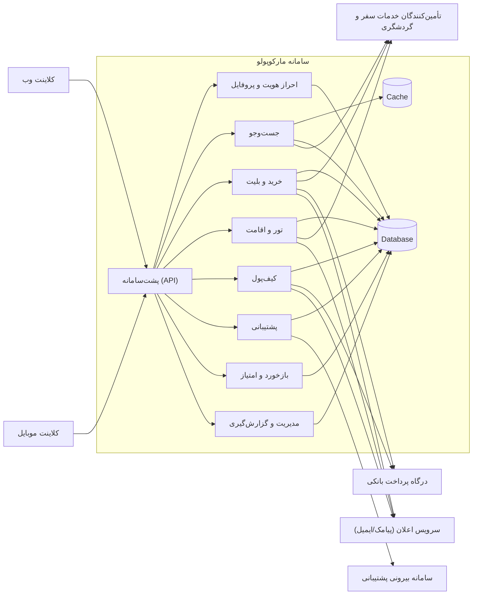
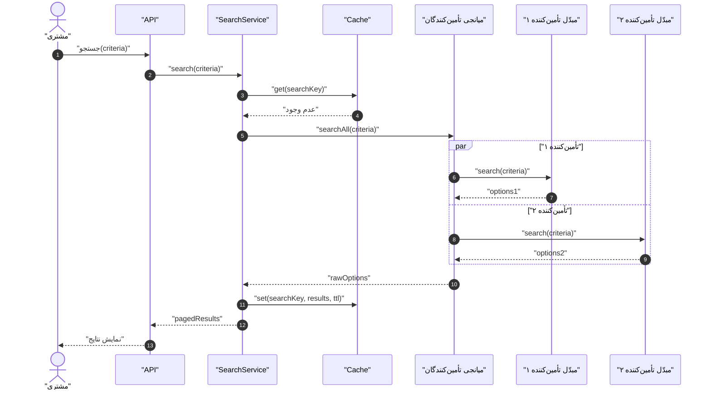
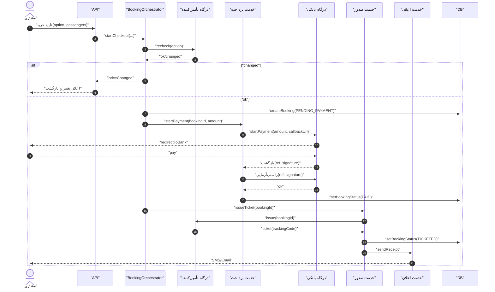
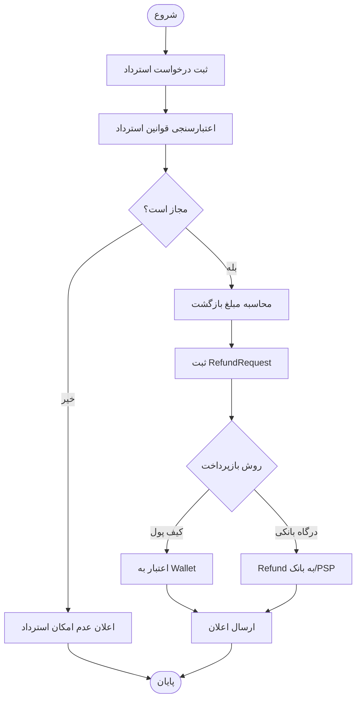
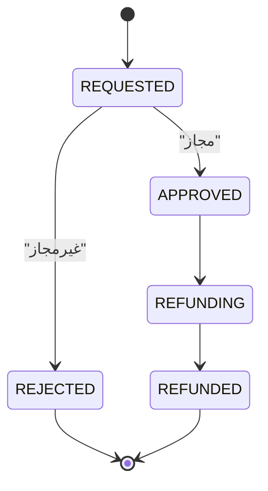
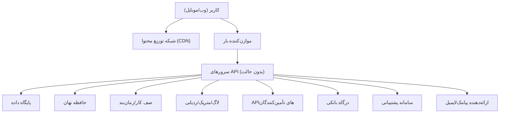
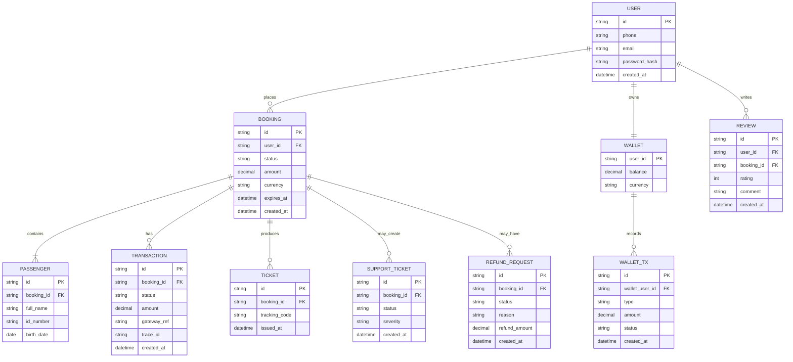

```mermaid
flowchart TB
  subgraph API["لایه API"]
    C1["AuthController — کنترلر احراز هویت"]
    C2["SearchController — کنترلر جست‌وجو"]
    C3["BookingController — کنترلر خرید/بلیت"]
    C4["TourismController — کنترلر تور/اقامت"]
    C5["WalletController — کنترلر کیف‌پول"]
    C6["SupportController — کنترلر پشتیبانی"]
    C7["ReviewController — کنترلر بازخورد"]
    C8["AdminController — کنترلر مدیریت"]
  end

  subgraph Domain["لایه دامنه/خدمات"]
    S1["AuthService — خدمت احراز هویت"]
    S2["SearchService — خدمت جست‌وجو"]
    S3["BookingOrchestrator — ارکستریتور خرید (Saga)"]
    S4["TicketingService — خدمت صدور"]
    S5["TourService/StayService — خدمات تور/اقامت"]
    S6["WalletService — خدمت کیف‌پول"]
    S7["SupportService — خدمت پشتیبانی"]
    S8["ReviewService — خدمت بازخورد"]
    S9["ReportingService — خدمت گزارش‌گیری"]
  end

  subgraph Integration["لایه یکپارچه‌سازی"]
    I1["ProviderGateway — درگاه تأمین‌کنندگان (Adapterها)"]
    I2["PaymentGatewayClient — کلاینت پرداخت"]
    I3["SupportSystemClient — کلاینت پشتیبانی"]
    I4["NotificationClient — کلاینت اعلان"]
  end

  subgraph Data["لایه داده/زیرساخت"]
    R1["Repositoryها (DB)"]
    R2["Cache — حافظه نهان"]
    R3["Job Queue — صف کار (اختیاری)"]
    R4["مشاهده‌پذیری — لاگ/متریک/ردیابی"]
  end

  C1-->S1
  C2-->S2
  C3-->S3
  C4-->S5
  C5-->S6
  C6-->S7
  C7-->S8
  C8-->S9

  S2-->I1
  S3-->I1
  S3-->I2
  S4-->I1
  S5-->I1
  S6-->I2
  S7-->I3
  S3-->I4
  S5-->I4
  S6-->I4
  S7-->I4

  S1-->R1
  S2-->R1
  S2-->R2
  S3-->R1
  S4-->R1
  S5-->R1
  S6-->R1
  S7-->R1
  S8-->R1
  S9-->R1
  S3-->R3
  S4-->R3
  Domain-->R4
```

# سند معماری نرم‌افزار (SAD) — سامانه آژانس مسافرتی «مارکوپولو»

> این نسخه بر اساس قالب `SAD-Template.docx` و با استفاده از محتوای `SAD.md` تکمیل شده است.  
> هرجا «TODO(VP)» دیدید یعنی نیاز به ترسیم/خروجی گرفتن نمودار در Visual Paradigm دارید.

## مشخصات سند

- سازمان: آژانس مسافرتی «مارکوپولو»
- سامانه: سامانه فروش/رزرو خدمات سفر (وب/موبایل)
- اعضای گروه: محمد صادقی، مهدی مالوردی
- نگارش: 1.0
- تاریخ: زمستان ۱۴۰۴

## تاريخچه بازبيني

| تاريخ | نسخه | توضيحات | تهيه‌كننده (سمت) |
| --- | --- | --- | --- |
| TODO | 1.0 | پيش‌نويس اوليه | TODO |

---

## 1) کلیات سند

### 1-1) هدف

این سند معماری نرم‌افزار سامانه «مارکوپولو» را به‌عنوان یک پلتفرم خدمات آنلاین سفر توصیف می‌کند تا:

- تصویر مشترکی از ساختار کلان سامانه، اجزا و رابط‌های میان آن‌ها ارائه شود.
- مرزبندی مسئولیت‌ها بین سامانه و سامانه‌های بیرونی (تأمین‌کنندگان، بانک و پشتیبانی) روشن شود.
- تصمیم‌های معماری و پیامدهای آن‌ها قابل دفاع و قابل پیگیری باشد.
- الزامات کیفیتی (کارایی، دسترس‌پذیری، امنیت، مقیاس‌پذیری و نگهداشت‌پذیری) به شاخص‌های قابل ارزیابی تبدیل شود.

### 1-2) محدوده

**داخل محدوده سامانه**

- جست‌وجوی خدمات سفر (پرواز/قطار/اتوبوس) و نمایش نتایج یکپارچه
- خرید بلیت: ثبت اطلاعات مسافر، بازتأیید ظرفیت/قیمت، پرداخت، صدور بلیت، ارسال اعلان
- استرداد بلیت: ثبت درخواست، محاسبه مبلغ بازگشت، بازپرداخت (درگاه/کیف‌پول)، ارسال اعلان
- خدمات گردشگری و جانبی: مشاهده/رزرو تور، جست‌وجو/رزرو اقامتگاه/هتل، بیمه مسافرتی، درخواست/پیگیری ویزا
- پرداخت: درگاه بانکی و کیف‌پول (افزایش موجودی/پرداخت/بازپرداخت)
- پشتیبانی ۲۴ ساعته: ثبت و پیگیری درخواست/تیکت
- ثبت نظر و امتیازدهی (پس از استفاده از خدمت/خرید)
- پنل مدیریتی: گزارش‌گیری و پایش عملیاتی
- یکپارچه‌سازی با تأمین‌کنندگان و مدیریت تسویه‌حساب

**خارج از محدوده سامانه**

- پیاده‌سازی سامانه‌های تأمین‌کنندگان (هواپیمایی/ریلی/اتوبوسرانی/هتل/تور)، درگاه بانکی و سامانه پشتیبانی (به‌عنوان سرویس‌های بیرونی مصرف می‌شوند).
- راه‌اندازی زیرساخت اختصاصی پیامک/ایمیل (به‌عنوان سرویس بیرونی مصرف می‌شود).

**ذی‌نفعان و نیازهای کلیدی**

| ذی‌نفع | نیاز/انتظار |
| --- | --- |
| مشتری | جست‌وجوی سریع و شفاف، پرداخت امن، صدور بلیت قابل اتکا، پشتیبانی پاسخگو |
| تیم پشتیبانی | دسترسی به وضعیت سفارش/پرداخت، ابزار پیگیری، ثبت وقایع و ممیزی |
| تیم فنی | معماری قابل نگهداری، جداسازی لایه یکپارچه‌سازی، مشاهده‌پذیری مناسب |
| تأمین‌کننده | ارتباط استاندارد و پایدار، کاهش درخواست‌های تکراری، تسویه‌حساب شفاف |
| کسب‌وکار | افزایش نرخ تبدیل، کاهش خطا، داده‌های قابل تحلیل، گزارش‌های مدیریتی |

---

## 2) نمایش معماری

### 2-1) سبک معماری (انتخاب‌شده)

- معماری **لایه‌ای** در پشت‌سامانه (لایه API → لایه دامنه/خدمات → لایه یکپارچه‌سازی → لایه داده)
- رویکرد **سرویس‌محور درون‌سازمانی** (تک‌استقرارِ ماژولار در فاز نخست با مرزبندی دامنه‌ها) و قابلیت گذار به ریزخدمت در صورت افزایش مقیاس/تیم
- یکپارچه‌سازی با سامانه‌های بیرونی از طریق **درگاه/مبدّل (Gateway/Adapter)** برای کاهش وابستگی

### 2-2) نمای سطح بالا (Context / Containers)

TODO(VP): یک «نمودار زمینه (Context)» و در صورت امکان «نمودار کانتینر (Containers)» در Visual Paradigm رسم کنید و خروجی را در `diagrams/vp-01-context.png` و `diagrams/vp-02-containers.png` قرار دهید.

> نسخه مرجع (قابل استفاده برای رسم در VP) — Mermaid:

### 2-3) نمای اجزای Backend (Component View)

TODO(VP): یک نمودار Component برای Backend در Visual Paradigm رسم کنید و خروجی را در `diagrams/vp-03-components.png` قرار دهید.

> نسخه مرجع (Mermaid):

---

## 3) اهداف و محدودیت‌های معماری

### 3-1) اهداف کیفیتی

| ویژگی کیفی | معیار ارزیابی | اندازه/محدوده مطلوب | راهکار معماری |
| --- | --- | --- | --- |
| کارایی | صدک ۹۵ زمان پاسخ جست‌وجو | کمتر از ۳ ثانیه | حافظه نهان، صفحه‌بندی، زمان‌سنجی برای تأمین‌کنندگان |
| دسترس‌پذیری | تعداد رخداد قطعی | کمتر از ۱ بار در هفته | کاهش سطح خدمت، تلاش مجدد کنترل‌شده، قطع‌کننده مدار سبک |
| مقیاس‌پذیری | توان عملیاتی API | مقیاس‌پذیری افقی | API بدون حالت + حافظه نهان + پایگاه داده مشترک |
| امنیت | رخداد نفوذ/تقلب | حداقل | راستی‌آزمایی پرداخت، امضا/توکن بازگشت بانک (callback)، ثبت وقایع ممیزی |
| نگهداشت‌پذیری | افزودن تأمین‌کننده جدید | سریع و کم‌ریسک | Adapter/Factory + تست قرارداد |
| مشاهده‌پذیری | قابلیت ردیابی | کامل | `traceId`/`correlationId` در خرید/پرداخت |

### 3-2) محدودیت‌ها (Constraints)

- **تنوع تأمین‌کنندگان:** APIهای ناهمگن، محدودیت نرخ درخواست و حساسیت زمانی پاسخ
- **پرداخت:** وابستگی به درگاه بانکی، نیاز به `Idempotency` و راستی‌آزمایی «بازگشت بانک» (callback)
- **کیف‌پول:** مدیریت موجودی و جلوگیری از دوباره‌خرج‌کردن
- **حریم خصوصی و مقررات:** محافظت از داده‌های شخصی و مالی کاربران
- **پشتیبانی:** نیاز به ثبت دقیق رخدادها برای پاسخ‌گویی و پیگیری

### 3-3) تصمیم‌های معماری (ADR خلاصه)

| تصمیم | دلیل | پیامد |
| --- | --- | --- |
| تک‌استقرار ماژولار در فاز اول | سرعت توسعه و هزینه عملیاتی کمتر | امکان گذار به ریزخدمت به‌کمک مرزبندی دامنه |
| ارکستریتور خرید (الگوی Saga) | پرهیز از تراکنش توزیع‌شده | نیاز به سناریوهای جبرانی و Jobهای تلاش‌مجدد |
| مبدّل برای تأمین‌کنندگان | تغییرپذیری و ناهمگنی بالا | هزینه توسعه Adapter، اما کاهش ریسک تغییرات |
| حافظه نهان برای جست‌وجو | کاهش زمان پاسخ و هزینه تماس بیرونی | نیاز به TTL و سیاست بی‌اعتبارسازی |
| کلید یکتایی عملیات پرداخت | جلوگیری از پرداخت/صدور تکراری | ذخیره و کنترل کلیدها در DB |

---

## 4) دید سناریوها

### 4-1) عینیت‌بخشی موارد کاربری

در این بخش، برای مواردکاربری کلیدی سامانه، سناریو و نمودارهای مرتبط ارائه می‌شود. پیشنهاد می‌شود (مطابق فاز ۲) حداقل دو موردکاربری انتخاب شود:

- یک موردکاربری با پیچیدگی کم (مثلاً `UC-01` جست‌وجوی خدمات سفر)
- یک موردکاربری با پیچیدگی متوسط/بالا (مثلاً `UC-02` خرید بلیت یا `UC-03` استرداد)

TODO(VP): برای هر UC انتخابی، در Visual Paradigm خروجی‌های زیر را آماده کنید:

- Use Case Specification (سناریو: پیش‌شرط، پس‌شرط، جریان اصلی، جریان‌های جایگزین)
- Sequence Diagram
- Activity Diagram (در صورت نیاز)
- State Diagram (برای موجودیت‌های وضعیت‌دار مثل Booking/RefundRequest)

TODO(VP): یک نمودار Use Case سطح سیستم برای کل سامانه رسم کنید و خروجی را در `diagrams/vp-00-usecase.png` قرار دهید.

### 4-2) فهرست موارد کاربری سطح سیستم

| دسته‌بندی | شناسه | کنشگر | موردکاربری کلان | توضیح |
| --- | --- | --- | --- | --- |
| Ticketing | UC-01 | مشتری | جست‌وجوی خدمات سفر | جستجو/فیلتر/مرتب‌سازی گزینه‌ها |
| Ticketing | UC-02 | مشتری | خرید بلیت | recheck ظرفیت/قیمت + پرداخت + صدور |
| Ticketing | UC-03 | مشتری | استرداد بلیت | لغو و بازگشت وجه |
| Tourism | UC-04 | مشتری | رزرو تور | انتخاب/پرداخت/تایید رزرو |
| Tourism | UC-05 | مشتری | رزرو اقامتگاه/هتل | انتخاب/پرداخت/تایید رزرو |
| Add-on | UC-06 | مشتری | بیمه مسافرتی | محاسبه/پرداخت/صدور بیمه‌نامه |
| Add-on | UC-07 | مشتری | درخواست/پیگیری ویزا | ثبت درخواست + پرداخت + پیگیری |
| Payments | UC-08 | مشتری | کیف پول | افزایش موجودی/پرداخت/تراکنش |
| Support | UC-09 | مشتری | پشتیبانی | ثبت و پیگیری تیکت |
| Feedback | UC-10 | مشتری | نظر/امتیاز | ثبت امتیاز پس از خرید |

### 4-3) سناریو — UC-01 (جست‌وجو) — توالی (عدم وجود در Cache)

TODO(VP): Sequence Diagram این سناریو را رسم کنید و خروجی را در `diagrams/vp-04-seq-uc01.png` قرار دهید.

> نسخه مرجع (Mermaid):

### 4-4) سناریو — UC-02 (خرید بلیت) — توالی (پرداخت، راستی‌آزمایی و صدور)

TODO(VP): Sequence Diagram این سناریو را رسم کنید و خروجی را در `diagrams/vp-05-seq-uc02.png` قرار دهید.

> نسخه مرجع (Mermaid):

### 4-5) سناریو — UC-03 (استرداد) — فعالیت و حالت

TODO(VP): Activity Diagram و State Diagram این سناریو را رسم کنید و خروجی را در `diagrams/vp-06-activity-uc03.png` و `diagrams/vp-07-state-refund.png` قرار دهید.

> نسخه مرجع (Mermaid):

---

## 5) دید منطقی (Logical View)

### 5-1) مدل لایه‌ای

- **ارائه (Presentation):** کلاینت وب/موبایل
- **API:** کنترلرها، اعتبارسنجی، احراز هویت/مجوز، محدودیت نرخ
- **دامنه/خدمات:** جست‌وجو، خرید/صدور/استرداد، گردشگری، کیف‌پول، پشتیبانی، بازخورد، گزارش‌گیری
- **یکپارچه‌سازی:** درگاه تأمین‌کنندگان، کلاینت پرداخت، کلاینت پشتیبانی، کلاینت اعلان
- **داده/زیرساخت:** پایگاه داده، حافظه نهان، صف کار (اختیاری)

### 5-2) مدل دامنه‌ها (Bounded Contexts)

| دامنه | مسئولیت | داده‌های اصلی |
| --- | --- | --- |
| Identity | ورود/ثبت‌نام/پروفایل | User, Session |
| Search | جستجو و نتایج | SearchKey, TripOption |
| Booking | سفارش و وضعیت‌ها | Booking, Passenger |
| Payments | تراکنش‌ها و راستی‌آزمایی پرداخت | Transaction, IdempotencyKey |
| Ticketing | صدور/واچر | Ticket |
| Tourism | تور/اقامتگاه | TourBooking, StayBooking |
| Wallet | موجودی و تراکنش کیف پول | Wallet, WalletTransaction |
| Support | تیکت‌ها و پیگیری | SupportTicket |
| Review | امتیاز و بازخورد | Review |

### 5-3) کلاس‌ها/الگوهای طراحی کلیدی (نمونه)

- **Facade:** `SearchFacade`, `BookingFacade`
- **Strategy:** `RankingStrategy`, `PricingStrategy`, `RefundPolicyStrategy`
- **Factory Method:** `ProviderAdapterFactory`, `PaymentGatewayClientFactory`
- **Adapter:** `AirlineAdapter`, `RailAdapter`, `BusAdapter`, `HotelAdapter`
- **Saga/Orchestrator:** `BookingOrchestrator` برای هماهنگی خرید و جبران

TODO(VP): اگر استاد «Class Diagram» خواسته، یک Class Diagram سطح‌بالا (تحلیلی/طراحی) برای دامنه‌های Search/Booking/Payments رسم کنید و خروجی را در `diagrams/vp-08-class-core.png` قرار دهید.

---

## 6) دید فرایند (Process View)

### 6-1) همزمانی و زمان‌بندی

- جست‌وجو: فراخوانی همزمان چند تأمین‌کننده با «مهلت زمانی پاسخ» و «کاهش سطح خدمت»
- خرید: رزرو موقت با زمان انقضا (TTL) + راستی‌آزمایی پرداخت + صدور
- استرداد: محاسبه مبلغ بازگشت + بازپرداخت (کیف پول/درگاه)

### 6-2) Job/Queue (اختیاری ولی پیشنهاد‌شده)

| Job | دلیل | سیاست |
| --- | --- | --- |
| تلاش‌مجدد صدور بلیت | خطای موقت تأمین‌کننده | ۳ بار تلاش با پس‌روی نمایی |
| پاکسازی رزروهای منقضی | آزادسازی منابع | هر ۵ دقیقه |
| ارسال مجدد اعلان‌های ناموفق | پایداری پیامک/ایمیل | تلاش‌مجدد + صف بن‌بست (Dead Letter) |

### 6-3) یکتایی عملیات و سازگاری

- استفاده از `IdempotencyKey` برای پرداخت و صدور (جلوگیری از اجرای تکراری در «بازگشت بانک»/تلاش‌مجدد)
- الگوی `Outbox` (پیشنهادی) برای ارسال اعلان‌ها با اطمینان و جلوگیری از از‌دست‌رفتن پیام
- ثبت `traceId` و `correlationId` برای هر سفارش/تراکنش جهت ردیابی انتها‌به‌انتها

---

## 7) دید فیزیکی (استقرار)

TODO(VP): یک Deployment Diagram در Visual Paradigm رسم کنید و خروجی را در `diagrams/vp-09-deployment.png` قرار دهید.

> نسخه مرجع (Mermaid):

---

## 8) دید توسعه و پیاده‌سازی

### 8-1) ساختار ماژول‌ها

| ماژول/پروژه/بسته | توضیح | فناوری‌های پیشنهادی | وابستگی‌ها |
| --- | --- | --- | --- |
| `ui-web` | رابط وب | React | `api` |
| `ui-mobile` | رابط موبایل | Flutter | `api` |
| `api` | پشت‌سامانه (API) | Python (FastAPI) | `db`, `cache`, `integrations`, `queue` |
| `db` | پایگاه داده | PostgreSQL | - |
| `cache` | حافظه نهان | Redis | - |
| `queue` | صف/کارهای پس‌زمینه | Celery/RQ | `redis` |
| `domain-*` | دامنه‌های اصلی | Python packages | `repositories`, `integrations` |
| `integrations-providers` | مبدّل/درگاه تأمین‌کنندگان | کلاینت HTTP + نگاشت داده | - |
| `integrations-bank` | پرداخت/راستی‌آزمایی | کلاینت HTTP + اعتبارسنجی امضا/توکن | - |
| `integrations-support` | تیکت/CRM | کلاینت HTTP | - |
| `integrations-notify` | پیامک/ایمیل | کلاینت HTTP | - |

### 8-2) قراردادهای API (نمونه)

| Endpoint | توضیح |
| --- | --- |
| `GET /search` | جستجو و نتایج صفحه‌بندی |
| `POST /bookings` | ایجاد سفارش/شروع پرداخت |
| `POST /payments/callback` | دریافت بازگشت بانک و راستی‌آزمایی پرداخت |
| `POST /refunds` | ثبت استرداد |
| `POST /wallet/topup` | افزایش موجودی کیف پول |
| `POST /support/tickets` | ثبت تیکت |

---

## 9) دید داده (اختیاری)

### 9-1) مدل داده (ERD)

TODO(VP): ERD را در Visual Paradigm رسم کنید و خروجی را در `diagrams/vp-10-erd.png` قرار دهید.

> نسخه مرجع (Mermaid):

### 9-2) سیاست‌های داده

- حداقل‌سازی داده‌های حساس (Data Minimization) و ذخیره‌سازی تنها موارد ضروری
- رمزنگاری در حال انتقال (TLS) و در صورت نیاز رمزنگاری ستون‌های حساس در پایگاه داده
- نگهداری لاگ تراکنش‌ها و لاگ ممیزی برای پاسخ‌گویی و پیگیری پشتیبانی

---

## 10) کارایی

### 10-1) راهکارهای کارایی

- حافظه نهان نتایج جست‌وجو با TTL (مثلاً ۵ تا ۱۵ دقیقه)
- صفحه‌بندی و خلاصه‌سازی بدنه پاسخ (Payload)
- زمان‌سنجی (Timeout) و محدودیت تلاش‌مجدد برای تأمین‌کنندگان
- استفاده از pool اتصال و queryهای ایندکس‌شده در پایگاه داده

### 10-2) نقاط گلوگاه و کنترل

| گلوگاه | ریسک | کنترل |
| --- | --- | --- |
| تأمین‌کننده کند/قطع | افزایش زمان پاسخ | کاهش سطح خدمت + قطع‌کننده مدار سبک |
| بازگشت بانک (callback) | تکرار/تقلب | راستی‌آزمایی + `IdempotencyKey` |
| صدور بلیت | خطای موقت | Retry job + تیکت پشتیبانی |

---

## 11) کیفیت

### 11-1) امنیت

- احراز هویت: توکن (JWT/Session) + محدودیت نرخ درخواست
- مجوزدهی: نقش‌ها (کاربر، پشتیبان، مدیر، تأمین‌کننده)
- پرداخت: راستی‌آزمایی بازگشت بانک (امضا/توکن) + جلوگیری از تکرار/بازپخش
- ذخیره‌سازی: هش رمز عبور (bcrypt/argon2)، عدم ذخیره اطلاعات کارت
- لاگ ممیزی برای رویدادهای مهم (ورود، پرداخت، صدور، استرداد)

### 11-2) قابلیت نگهداری و توسعه‌پذیری

- مبدّل‌های تأمین‌کنندگان با قراردادهای مشخص و قابل تست
- تست قرارداد (Contract Test) برای یکپارچه‌سازی‌ها
- جداسازی دامنه‌ها و کاهش وابستگی میان ماژول‌ها

### 11-3) مشاهده‌پذیری

- لاگ ساختاریافته همراه با `traceId`
- شاخص‌های کلیدی: نرخ تبدیل، زمان پاسخ جست‌وجو، نرخ خطای پرداخت، نرخ خطای صدور
- ردیابی توزیع‌شده برای مسیرهای حساس (خرید/پرداخت/صدور/استرداد)

---

## پیوست — چک‌لیست تحویل

- [ ] تاریخچه بازبینی تکمیل شد.
- [ ] نمودارهای VP خروجی گرفته و در پوشه `diagrams/` قرار گرفت.
- [ ] شماره‌گذاری بخش‌ها مطابق قالب است.
- [ ] تصاویر در Word/Export نهایی درست نمایش داده می‌شوند.

